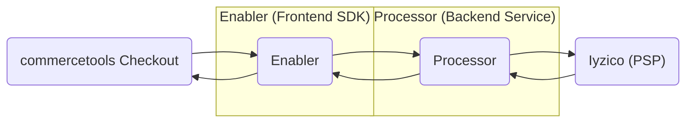

# commercetools Iyzico Connector

This repository provides a connect for integration to Iyzico payment service provider (PSP).

## Features

No implementation yet

(suggested breakdown ticket)[https://dev.azure.com/MarsDevTeam/RoyalCaninEcommerce/_wiki/wikis/RoyalCaninEcommerce.wiki/44260/Suggested-ticket-breakdown-roadmap]

## Overview

Enabler: Enables the Checkout product to control when and how the payment experience is loaded based on business configuration. The connector does not provide frontend UI components; instead, it uses the PSP's hosted checkout form, which is rendered within an iframe.


Processor: Acts as the backend service layer that integrates with the Iyzico platform. It is responsible for managing payment transactions with Iyzico, handling payment-related operations, and updating Payment resources in commercetools Composable Commerce. The connect-payment-sdk is used to manage request context, session handling, and other utilities required for transaction processing.



## Getting started

```bash 
cd processor
cp .env.template .env
# Fill in IYZICO_API_KEY, IYZICO_SECRET_KEY and IYZICO_BASE_URL

npm install
npm run build
npm run iyzico:ping # verify sandbox connectivity
```

the standalone scripts below hit the real Iyzico sandbox and bypass commercetools, so they only need the `IYZICO_*` vars : 

| Var | Value |
|-----|-------|
| `IYZICO_BASE_URL` | `https://sandbox-api.iyzipay.com`|
| `IYZICO_API_KEY`| from the [Iyzico sandbox merchant panel](https://sandbox-api.iyzipay.com)|
| `IYZICO_SECRET_KEY`|  from the [Iyzico sandbox merchant panel](https://sandbox-api.iyzipay.com)|
| `IYZICO_TIMEOUT_MS`| optional, default to `10000`|

## Testing the checkoutForm flow with scripts

The full CheckoutForm flow is **initialize -> pay -> retrieve** cover only Iyzico.

### Intialize + render the form

```bash
cd processor
npm run iyzico:checkout-form
```

Prints the `token`, `paymentPageUrl` and writes the `checkout-form.html` on the `src/` folder.

```bash
✅ status      : success
   token       : 12345
   paymentPageUrl: https://sandbox-cpp.iyzipay.com?token=12345&lang=tr
```

### Pay with a sandbox test card

Pay on the form with an Iyzico sandbox [test card](https://docs.iyzico.com/en/add-ons/test-cards), any future exire date, any cvc
On submit, Iyzico POST a `token` to the `callbackUrl`

#### Retrieve the result


```bash
npm run iyzico:retrieve -- <token> # <token> from step 3
```

The retrieve verifye the response and prints Iyzico's result : 

```bash
✅ status        : success
   paymentStatus : SUCCESS
   paymentId     : 35997620
   fraudStatus   : 1 (1 approved, 0 review, -1 rejected)
   price / paid  : 1.2 / 1.2 TRY
   card          : MASTER_CARD •••• 0000
   installment   : 1
```
