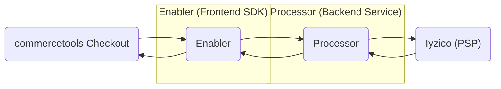

# commercetools Iyzico Connector

This repository provides a connect for integration to Iyzico payment service provider (PSP).

## Features

No implementation yet

(suggested breakdown ticket)[https://dev.azure.com/MarsDevTeam/RoyalCaninEcommerce/_wiki/wikis/RoyalCaninEcommerce.wiki/44260/Suggested-ticket-breakdown-roadmap]

## Overview

Enabler: Enables the Checkout product to control when and how the payment experience is loaded based on business configuration. The connector does not provide frontend UI components; instead, it uses the PSP's hosted checkout form, which is rendered within an iframe.

Processor: Acts as the backend service layer that integrates with the Iyzico platform. It is responsible for managing payment transactions with Iyzico, handling payment-related operations, and updating Payment resources in commercetools Composable Commerce. The connect-payment-sdk is used to manage request context, session handling, and other utilities required for transaction processing.

```mermaid
flowchart LR

    checkout("commercetools Checkout")

    subgraph enablerLayer["Enabler (Frontend SDK)"]
        enabler("Enabler")
    end

    subgraph backend["Processor (Backend Service)"]
        processor("Processor")
    end

    psp("Iyzico (PSP)")

    checkout --> enabler
    enabler --> processor
    processor --> psp
    psp --> processor
    processor --> enabler
    enabler --> checkout
```

## Development 